<h1 align="center">Sepet</h1>

<p align="center">
  <strong>Fişlerinden kendi enflasyonunu hesaplayan mobil uygulama.</strong><br>
  TÜİK herkes için tek bir sepeti varsayar. Seninki o değil.
</p>

<p align="center">
  <a href="https://github.com/KaanCan1/Sepet/actions/workflows/ci.yml">
    
  </a>
  
  
  
  
</p>

<p align="center">
  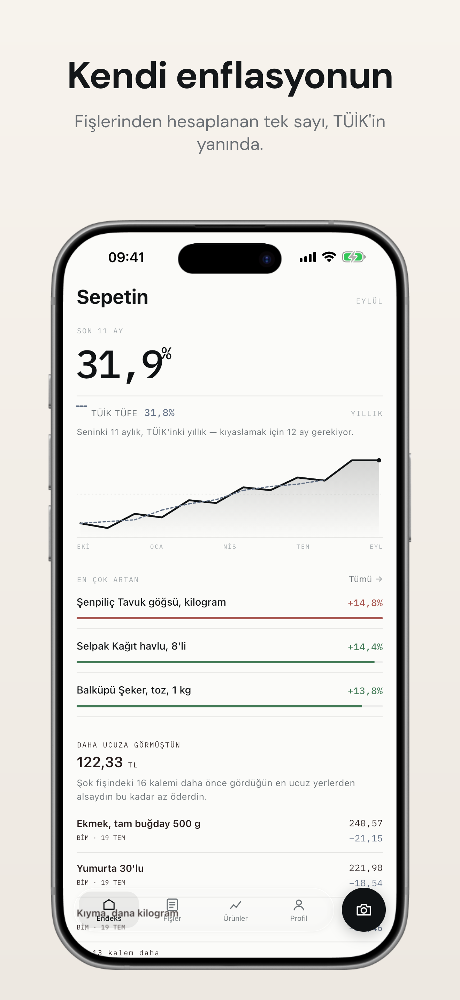
  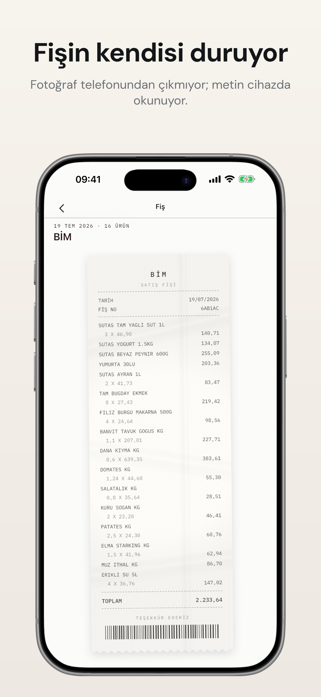
  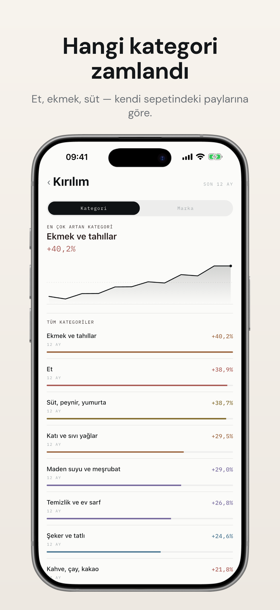
  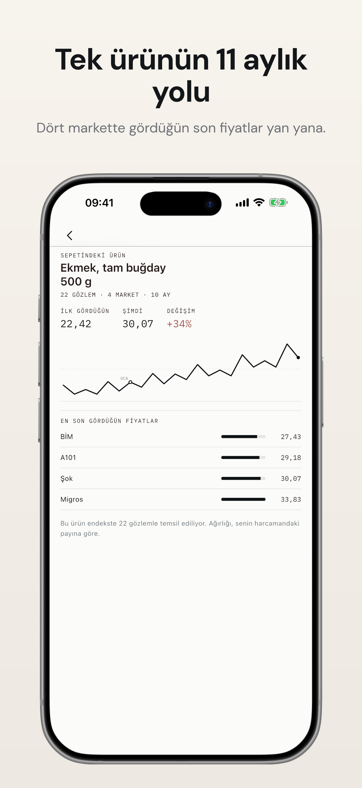
  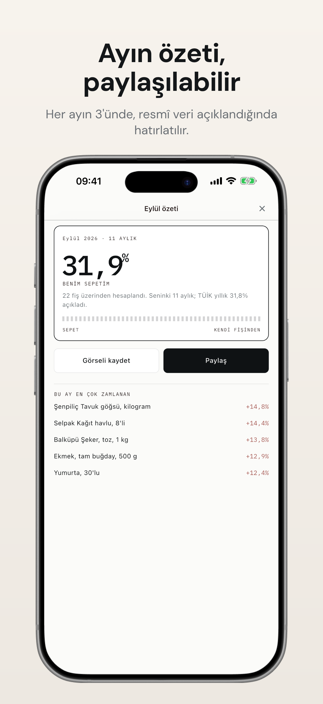
</p>

<p align="center">
  <sub><b>Endeks</b> · <b>Fiş</b> · <b>Kırılım</b> · <b>Ürün geçmişi</b> · <b>Aylık kart</b></sub>
</p>

<p align="center">
  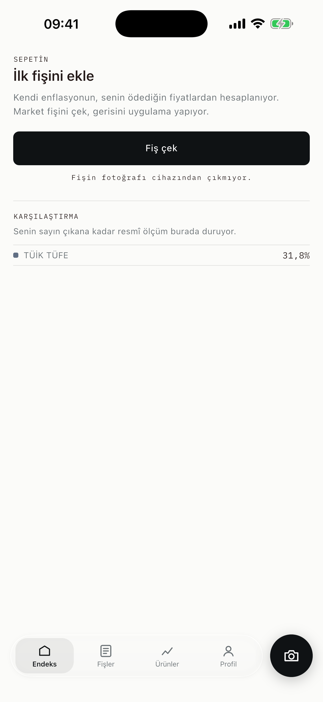
  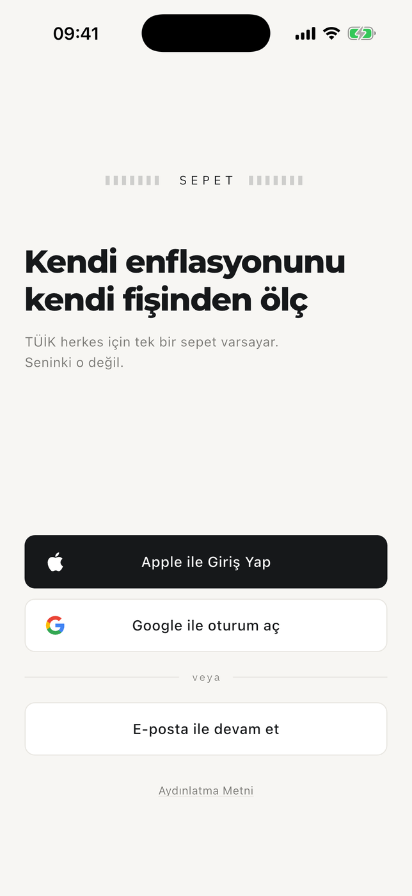
  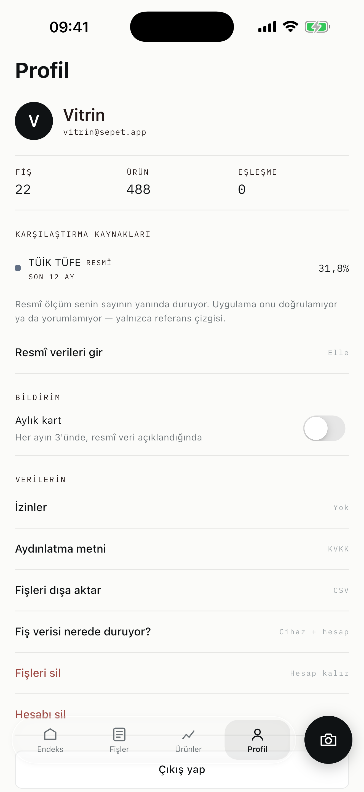
</p>

<p align="center">
  <sub><b>İlk açılış</b> · <b>Karşılama</b> · <b>Profil</b></sub>
</p>

---

## Neyi çözüyor

Resmî enflasyon rakamı, ülke ortalamasını temsil eden sabit bir mal sepetinin
fiyat değişimi. Ama sen o sepeti almıyorsun. Kirada mı oturuyorsun, arabanla mı
işe gidiyorsun, çocuğun var mı — hepsi senin sepetini ortalamadan uzaklaştırıyor.

Sepet, market fişlerini okuyup **senin fiilen aldığın ürünlerden** bir fiyat
endeksi kuruyor ve resmî ölçümün yanına koyuyor. Hiçbirini
doğrulamıyor ya da yorumlamıyor — sadece referans çizgisi olarak duruyorlar.

## Çekirdek döngü

**tara → eşle → ölç → paylaş**

| | Ekran | İş |
|---|---|---|
| **00** | Karşılama | Apple, Google ya da e-posta ile giriş. Sağlayıcı akışı henüz sahte; jetonu üreten uç değişecek, saklayan katman aynı kalacak. |
| **01** | Endeks | Tek sayı: son 12 ayda senin sepetin. Grafikte kendi serinin yanında TÜİK TÜFE kesikli çizgi olarak duruyor — iki seri ortak bir aya 100'leniyor, yani TÜİK'in taban yılı ekranda görünmüyor ve ikisi aynı soruyu cevaplıyor. TÜİK'in henüz açıklamadığı ay boş bırakılıyor, çizgi orada bitiyor. |
| **02** | Fiş ekleme ve fiş | Fotoğraf → cihaz üstünde OCR → düzeltilebilir taslak → kayıt. Fişin kâğıt hâli ve altında yorumlanmış satırlar; emin olunamayan satır zam kırmızısı şeritle işaretlenir ve tek akışta sırayla çözülür. |
| **03** | Ürün geçmişi | Tek ürünün gözlem geçmişi, marketler arası son fiyatlar, 12 aylık değişim. Listede her satırın sağında aynı gözlemlerden çizilen kıvılcım grafiği var; tek gözlemli üründe çizilmiyor, çünkü iki nokta olmadan eğim yok. |
| **04** | Aylık kart | Paylaşılabilir özet kart (PNG olarak dışa aktarılır) ve ayın en çok zamlanan kalemleri. |
| **05** | Kırılım | Hangi kategori, hangi marka. Her seri kendi kümesinde yeniden ağırlıklandırılıyor — yüzdeler birbirine eklenmez. |

Fiş yokken ekran boş kalmıyor: yapılacak tek iş, tek bir birincil eylem ve
zaten bağımsız olan resmî karşılaştırma çizgisi gösteriliyor.

Manşetteki iki sayı ancak aynı pencereye baktıklarında çıkarılıyor. TÜİK her
zaman yıllık açıklıyor; kullanıcının serisi 12 ay dolmadan daha kısa bir
pencere. İkisini doğrudan çıkarmak bir ayda %17 artan sepet için "TÜİK'in
17,1 puan altında" yazıyordu — çıkarma işlemi doğru, cümle yanlış. Pencere
dolmadan fark yazılmıyor; TÜİK sayısı duruyor, yanında ne olduğu yazıyor.
Grafikteki iki çizgide bu sorun yok: ikisi aynı ayda başlayıp aynı ayda
bitiyor.

Yanlarında: fiş ve ürün listeleri, fiş detayı, profil ve oturum, KVKK aydınlatma
ve açık rıza ekranları.

## Mimari

<p align="center">
  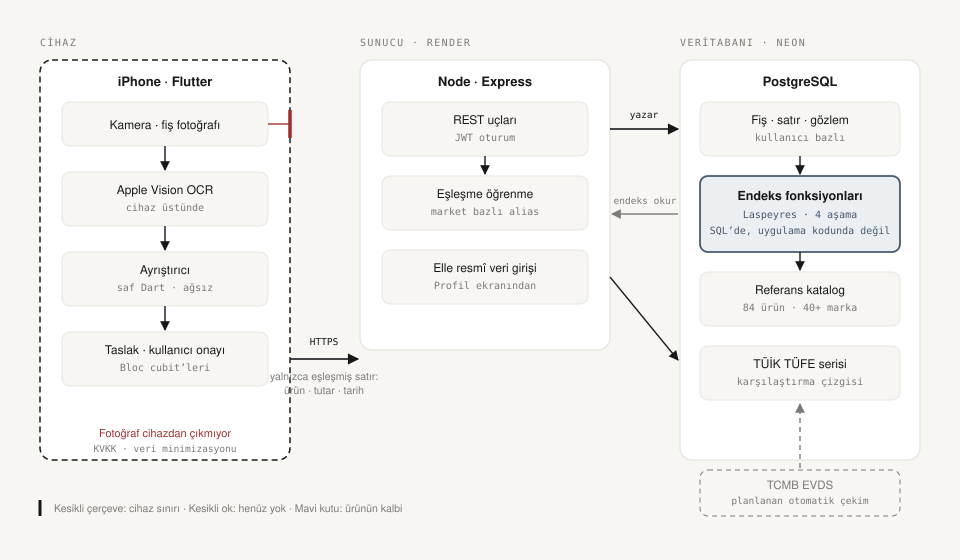
</p>

Kesikli çerçeve bilerek orada: **fişin fotoğrafı cihaz sınırını geçmiyor.**
Metin cihaz üstünde okunuyor, sunucuya yalnızca eşleşmiş satırlar gidiyor —
ürün, tutar, tarih. KVKK'daki veri minimizasyonu bir politika metni değil,
mimarinin bir özelliği.

Mavi kutu ikinci karar: **endeks uygulama kodunda değil, verinin yanında.**
Dört SQL fonksiyonu, tek işlemde:

<p align="center">
  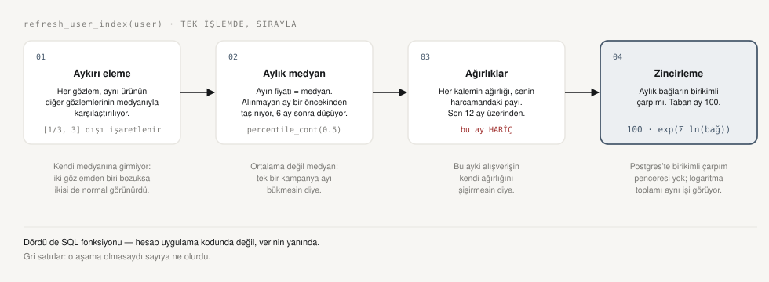
</p>

Gri satırlar o aşama olmasaydı sayıya ne olacağını söylüyor. Şemaların
kaynağı ve renk eşlemesi: [`docs/diagrams/`](docs/diagrams/).

### Karşılaştırma serisi

TÜİK TÜFE, **TCMB EVDS** üzerinden çekiliyor — TÜİK'in kendi veri portalı
otomatik erişimde yönlendirmeye düşüyor, MEDAS oturum tabanlı bir arayüz.
Resmî ve makine okunur kanal TCMB'ninki.

`EVDS_API_KEY` tanımlıysa sunucu açılışta seriyi tazeliyor; tazelik kontrolü
20 gün, yani seri ayda bir açıklandığı için ağa ayda bir kez çıkılıyor.
Anahtar yoksa uygulama çalışmayı sürdürüyor ve aylar Profil → *Resmî
verileri gir* ekranından elle girilebiliyor. İki yol birbirini dışlamıyor.

Sözleşme belgelenmemiş; EVDS uygulamasının kendi paketinden çıkarılıp
gerçek anahtarla doğrulandı ve [`test/evds.spec.ts`](server/test/evds.spec.ts)
ile sabitlendi.

## Projenin kalbi: `eşleşme?`

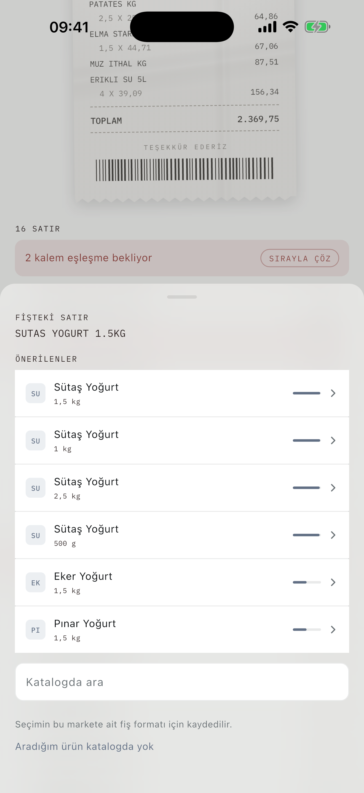

Fişteki `MIGROS T.YAGLI YOGU.` satırı hangi kanonik ürüne gidiyor? Marka ve
ürünü sunucu bulanık eşleştirmeyle kendi çözüyor — ama **1 kg mı 3 kg mı**
sorusunun cevabı fişte yazmıyor. Uygulama orada **tahmin etmiyor, soruyor**;
her seçeneğin yanında o boyu seçersen endekse girecek birim fiyat duruyor.

Bunun iki karşılığı var:

**Doğruluk.** Yanlış eşleşme endeksi sessizce bozar — kullanıcı hiç fark etmez.
Soru sormak bozmaz.

**Maliyet.** Her fiş satırı için bir dil modeli çağırmak, kullanıcı başına aylık
maliyeti hızla anlamsızlaştırır. Bu mimaride OCR cihaz üstünde ve bedava; model
yalnızca belirsizlik çözücü olarak devreye giriyor. Onaylanan eşleşme market fiş
formatı bazında önbelleğe alınıyor — aynı format bir daha sorulmuyor.

<br clear="right">

## Tasarım

İki katman:

**İçerik — kâğıt fiş.** Başlıklar serif, sayılar monospace: uygulamanın malzemesi
kâğıt fiş olduğu için. Renk tek yerde harcanıyor, zam kırmızısında. Paylaşım
kartının tırtıklı kenarı fişin koparma çizgisi.

**Krom — iOS 26 Liquid Glass.** Üst bar, alt sayfalar ve yüzen kapsül sekme
çubuğu (ondan ayrık kamera düğmesiyle) arkasını bulanıklaştırıyor, üst kenarında
ışık topluyor. İçerik camın altından akıyor.

**Hareket — basılıyor, kaymıyor.** Üçüncü katman ilk ikisinin metaforunu sürdürüyor:
yazıcıdan çıkan bir fiş satır satır belirir, hepsi birden değil. Endeks ekranı
okuma sırasıyla basılıyor — önce cevap (büyük sayı), sonra kanıtı. Bloklar 10
piksel aşağıdan yükselerek soluyor; mesafe kasten kısa, "kaydı" demeyecek kadar.

Grafik solmuyor, **çiziliyor**: yatay eksen zaman, çizginin soldan sağa
ilerlemesi o ekseni okutuyor. Hareket burada süs değil, veriyi anlatan şeyin
kendisi. Süreler `lib/widgets/motion.dart` içinde tek yerde — renk ve tipografi
gibi hareket de belirteçle.

Animasyon bir kez oynuyor: aşağı çekip tazelemek her şeyi yeniden zıplatmıyor.
İşletim sisteminde **Hareketi Azalt** açıksa hiçbir şey oynamıyor — bu incelik
değil, vestibüler rahatsızlığı olan kullanıcı için gereklilik.

Serif ve mono fontlar depoya gömülü — Source Serif 4 ve IBM Plex Mono, ikisi de
OFL. Sistem fontlarına güvenilseydi Android tarafında tipografi çökerdi.

## Yığın

| Katman | Seçim | Neden |
|---|---|---|
| İstemci | **Flutter 3.47** (FVM ile sabit) | Tek kod tabanı, iki mağaza |
| Vitrin tipografisi | **Montserrat** | Gotham'ın (Obama 2008 kampanyası) ücretsiz en yakın karşılığı — kelime işareti, manşet sayı ve büyük başlıklarda |
| OCR | **Apple Vision** (cihaz üstünde) | Fişin fotoğrafı cihazdan çıkmıyor. ML Kit yerine Vision: ek pod yok, Apple Silicon simülatöründe de çalışıyor |
| Krom | **liquid_glass_widgets** | Yüzen kapsül ve daire düğme gerçek kırılma/speküler kenar ile — elle yazılmış `BackdropFilter` taklidi değil |
| Normalizasyon | Kural + bulanık eşleşme (Postgres `pg_trgm`) | Fiş satırı ile katalog arasındaki köprü. Model çağrısı yok, ölçülebilir: `match-quality.spec.ts` |
| Backend | **Node.js/Express + PostgreSQL** | Kullanıcı, fiş, kanonik ürün, alias tablosu, fiyat gözlemleri, Laspeyres endeksi |
| Karşılaştırma | TÜİK TÜFE, **TCMB EVDS** üzerinden | Resmî dağıtım kanalı; TÜİK'in kendi portalı otomatik erişime kapalı |

> [!NOTE]
> Eşleşemeyen satırlar için **Claude API ile normalizasyon** düşünüldü ama
> yazılmadı: bulanık eşleşme ölçülüp kalibre edilince otomatik eşleşme oranı
> %57,5'ten %88'in üzerine çıktı (`server/test/match-quality.spec.ts` bu tabanı
> koruyor), kalanı modele sormanın maliyeti kendini savunmuyor. Yapılırsa anahtar
> istemciye gömülmez — derlenmiş uygulamadan çıkarılabilir — çağrı kendi
> backend'imiz üzerinden geçer.

## KVKK

Fiş verisi kişisel veridir; uygulama buna göre kurgulandı.

- **Fişin fotoğrafı sunucuya gitmiyor.** Metin cihaz üstünde okunuyor, görsel iş
  bitince siliniyor. Sunucuya yalnızca eşleşmiş satırlar gidiyor.
- **Hesap hizmeti açık rızaya dayanmıyor**, sözleşmenin ifasına (KVKK m. 5/2-c).
  Rıza ancak *hayır diyebiliyorsan* geçerlidir; hizmetin kendisini rızaya
  bağlamak yanlış olurdu.
- **Aydınlatma ve açık rıza ayrı ekranlarda.** Kurul'un 18.02.2026 tarihli
  [2026/347 sayılı ilke kararı][kvkk-347] ikisinin tek metinde birleştirilmesini
  yasaklıyor. İki isteğe bağlı izin (anonim endekse katkı, pazarlama) varsayılan
  kapalı ve her an geri alınabilir.
- **Özel nitelikli veri toplanmıyor.** Alışveriş kaydı bu kapsamda değil; ilaç ve
  reçete satırları endekse dahil edilmiyor.

Bir test bunu koruma altına alıyor: aydınlatma ekranında hiçbir onay anahtarı
bulunmadığını doğruluyor.

[kvkk-347]: https://www.kvkk.gov.tr/Icerik/8710/veri-sorumlulari-tarafindan-acik-riza-ve-aydinlatma-metinlerinin-ayri-ayri-duzenlenmesi-gerektigi-hakkinda-kisisel-verileri-koruma-kurulunun-18-02-2026-tarihli-ve-2026-347-sayili-ilke-karari

## Çalıştırma

Proje Flutter sürümü [`.fvmrc`](.fvmrc)'de sabit ve [FVM][fvm] ile bağlanıyor —
makinendeki global kuruluma dokunmadan. CI de sürümü aynı dosyadan okuyor, yani
yerel ile CI'ın ayrışması mümkün değil.

```bash
brew tap leoafarias/fvm && brew install fvm
fvm use                  # .fvmrc'deki sürümü kurar
fvm flutter run
```

Denetimler — CI'ın çalıştırdığının birebir aynısı:

```bash
./tool/check.sh
```

> Betik biçimlendirmeyi projeye bağlı Flutter'ın Dart'ıyla yapar ve sürüm
> uyuşmazlığında uyarır. Çıplak `dart format` sistemdeki başka bir Dart SDK'sını
> çalıştırıp yerelde temiz görünen kodu CI'da patlatabiliyor.

[fvm]: https://fvm.app

## Katkı akışı

`main` her zaman yeşil: doğrudan push kapalı, her değişiklik PR üzerinden geçiyor
ve CI yeşile dönmeden birleştirilemiyor.

```
main ──────────────●───────────●──────►
                  ╱           ╱
   feat/ocr ─────●           ╱
   fix/tab-bar ──────────────●
```

- Dal adları: `feat/…`, `fix/…`, `chore/…`, `docs/…`
- [Conventional Commits](https://www.conventionalcommits.org/):
  `feat(scan): eşleşme onayı alt sayfası`
- **Squash merge** — `main` doğrusal kalıyor, her PR tek commit
- Birleşen dal otomatik siliniyor

```bash
git switch -c feat/ocr
# ...
./tool/check.sh
git push -u origin feat/ocr
gh pr create --fill
```

**CI** her PR'da: `dart format` denetimi → `flutter analyze --fatal-infos` →
`flutter test --coverage` → Android (APK) ve iOS (`--no-codesign`) derlemeleri.

**Release**, `v*.*.*` etiketi atıldığında APK + AAB üretip GitHub Release'e
ekliyor. TestFlight adımı imzalama sertifikaları eklenene kadar atlanıyor.

## Proje yapısı

```
lib/
├── data/          modeller, biçimlendirme, API istemcisi, depo
├── state/         cubit'ler — oturum, endeks, fişler, ürünler, kırılım
├── screens/       ekranlar
├── theme/         tasarım belirteçleri (renk, tipografi)
└── widgets/       cam yüzeyler, grafik motoru, çizgi ikonlar, ekran kabuğu
```

Her iki grafik de tek bir `CustomPainter` üzerinde; ikonlar SVG değil, çizim.

**Durum yönetimi: Bloc (Cubit).** Uygulama durumu — oturum, endeks, fiş
listesi, ürünler, kırılım — widget ağacının dışında, `lib/state/` altındaki
cubit'lerde. Böylece uygulamayı ayağa kaldırmadan, kare beklemeden birim
testi yazılabiliyor (`test/cubit_test.dart`).

Sunucudan veri çeken her ekran aynı üç hâli yaşıyor, o yüzden ortak bir taban
var: `DataCubit<T>` yalnızca `fetch()` istiyor, hata yakalamayı ve
`DataLoading / DataFailure / DataReady` geçişlerini kendisi yapıyor. Durumlar
mühürlü sınıf, yani derleyici eksik dal bırakılmasına izin vermiyor ve "hem
yükleniyor hem hatalı" gibi geçersiz bileşimler kurulamıyor.

`setState` tamamen kalkmadı, kalkmamalı da: sekme indeksi, basılma
animasyonu, açılır pencerenin açıklığı gibi tek bir widget'ın içinde doğup
ölen geçici durumlar yerinde duruyor. Bloc'a taşınan şey uygulama durumu.

Sekme ekranlarının cubit'leri kabuğun üstünde, ayrıntı ekranlarınınki
yönlendirmeyle birlikte doğup ölüyor. Sebebi somut: fiş eklendiğinde hem
endeks hem fiş listesi bayatlıyor, ikisi ekrana bağlı olsaydı sekme
değiştirmeden tazelenemezlerdi.

## Telefona kurmak

Uygulama sunucunun adresini derleme zamanında alıyor:

```bash
SEPET_API_URL=https://sepet-api.onrender.com ./tool/run-device.sh
```

iPhone'da önce **Ayarlar → Gizlilik ve Güvenlik → Geliştirici Modu** açık
olmalı. Ücretsiz Apple ID ile imzalama profili **7 gün** geçerli; süre dolunca
aynı komut yeniden çalıştırılır. Apple Developer Program üyeliğiyle bu süre bir
yıla çıkıyor ve TestFlight açılıyor.

> iOS'un ATS kuralı düz HTTP'ye izin vermiyor — adres HTTPS olmak zorunda.
> Render ve Neon ikisi de HTTPS veriyor.

## Sunucu

Endeksin veri modeli ve hesabı [`server/`](server/) altında. Laspeyres mantığı
uygulama kodunda değil **SQL fonksiyonlarında** duruyor — dört aşama: aykırı
eleme, aylık medyan + boşluk doldurma, harcama payı ağırlıkları, zincirleme.

```bash
brew services start postgresql@14 && createdb sepet
cd server && npm install && npm run migrate:up && npm test
```

Ayrıntı ve bilinen sınırlar: [server/README.md](server/README.md)

## Yol haritası

- [x] Cihaz üstünde OCR — Apple Vision; fişin fotoğrafı telefondan çıkmıyor
- [x] Node/Express + Postgres backend, JWT oturum
- [x] Kanonik ürün şeması (grup + marka + boy), Laspeyres endeks SQL'i
- [x] TÜİK TÜFE serisinin TCMB EVDS üzerinden aylık çekimi
- [ ] Apple ile Giriş — kimlik sağlayıcı ucu henüz yok, giriş `/auth/dev-login`
      üzerinden. Apple Developer Program üyeliğine bağlı.
- [x] Ayın 3'ünde aylık kart bildirimi — yerel bildirim, sunucu kimseye itmiyor
- [ ] App Store yayını

Android OCR yazılmadı: `sepet/ocr` kanalının yalnızca iOS karşılığı var. Hedef
şimdilik yalnızca App Store, Android tarafı derlenebilir kalıyor.

## Lisans

MIT — bkz. [LICENSE](LICENSE). Gömülü fontların lisansları:
[assets/fonts/LICENSES.md](assets/fonts/LICENSES.md).
