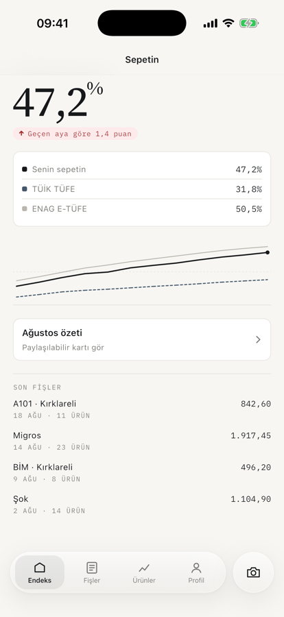
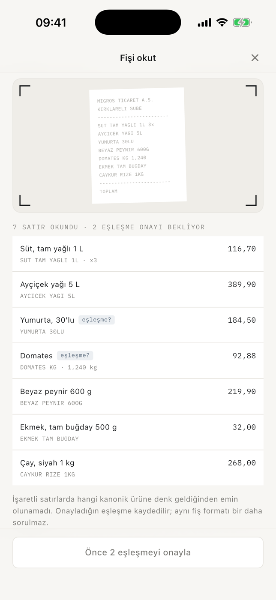
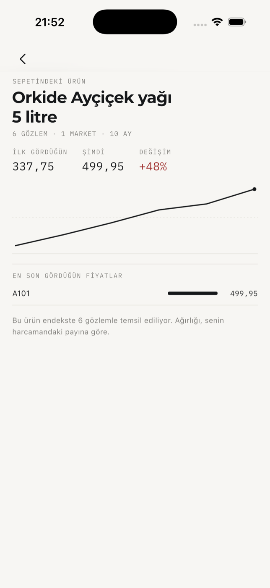
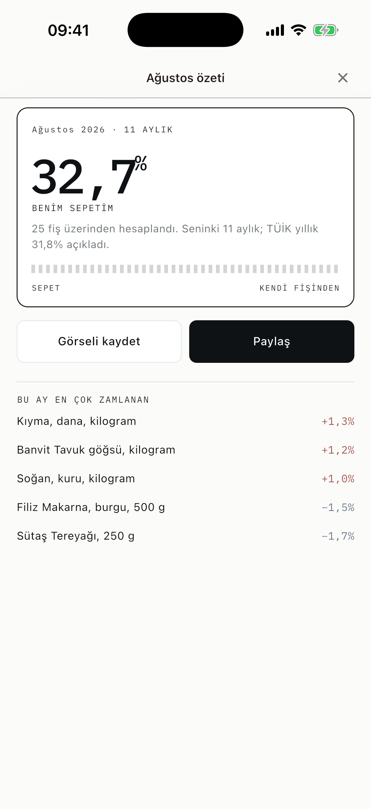

<h1 align="center">Sepet</h1>

<p align="center">
  <strong>Fişlerinden kendi enflasyonunu hesaplayan mobil uygulama.</strong><br>
  TÜİK ve ENAG herkes için tek bir sepeti varsayar. Seninki o değil.
</p>

<p align="center">
  <a href="https://github.com/KaanCan1/Sepet/actions/workflows/ci.yml">
    
  </a>
  
  
  
  
</p>

<p align="center">
  
  
  
  
  
</p>

<p align="center">
  <sub><b>Endeks</b> · <b>Fiş okuma</b> · <b>Ürün geçmişi</b> · <b>Aylık kart</b></sub>
</p>

---

## Neyi çözüyor

Resmî enflasyon rakamı, ülke ortalamasını temsil eden sabit bir mal sepetinin
fiyat değişimi. Ama sen o sepeti almıyorsun. Kirada mı oturuyorsun, arabanla mı
işe gidiyorsun, çocuğun var mı — hepsi senin sepetini ortalamadan uzaklaştırıyor.

Sepet, market fişlerini okuyup **senin fiilen aldığın ürünlerden** bir fiyat
endeksi kuruyor ve resmî/bağımsız ölçümlerin yanına koyuyor. Hiçbirini
doğrulamıyor ya da yorumlamıyor — sadece referans çizgisi olarak duruyorlar.

## Çekirdek döngü

**tara → eşle → ölç → paylaş**

| | Ekran | İş |
|---|---|---|
| **00** | Karşılama | Apple, Google ya da e-posta ile giriş — ya da hesapsız devam. Giriş zorunlu değil; hesapsız kullanımda fişler yalnızca cihazda kalır. |
| **01** | Endeks | Tek sayı: son 12 ayda senin sepetin. Altında TÜİK/ENAG karşılaştırması, seri grafiği ve son fişler. |
| **02** | Fiş okuma | Cihaz üstünde OCR, ardından satırların kanonik ürünlere eşlenmesi. Emin olunamayan satır işaretlenir. |
| **03** | Ürün geçmişi | Tek ürünün gözlem geçmişi, marketler arası son fiyatlar, 12 aylık değişim. |
| **04** | Aylık kart | Paylaşılabilir özet kart (PNG olarak dışa aktarılır) ve ayın en çok zamlanan kalemleri. |

Yanlarında: fiş ve ürün listeleri, fiş detayı, profil ve oturum, KVKK aydınlatma
ve açık rıza ekranları.

## Projenin kalbi: `eşleşme?`


Fişteki `YUMURTA 30LU` satırı hangi kanonik ürüne gidiyor? 30'lu yumurta mı,
15'li mi? Normalizasyon emin olamadığında uygulama **tahmin etmiyor, soruyor.**

Bunun iki karşılığı var:

**Doğruluk.** Yanlış eşleşme endeksi sessizce bozar — kullanıcı hiç fark etmez.
Soru sormak bozmaz.

**Maliyet.** Her fiş satırı için bir dil modeli çağırmak, kullanıcı başına aylık
maliyeti hızla anlamsızlaştırır. Bu mimaride OCR cihaz üstünde ve bedava; model
yalnızca belirsizlik çözücü olarak devreye giriyor. Onaylanan eşleşme market fiş
formatı bazında önbelleğe alınıyor — aynı format bir daha sorulmuyor.

<br clear="right">

## Tasarım

İki katman:

**İçerik — kâğıt fiş.** Başlıklar serif, sayılar monospace: uygulamanın malzemesi
kâğıt fiş olduğu için. Renk tek yerde harcanıyor, zam kırmızısında. Paylaşım
kartının tırtıklı kenarı fişin koparma çizgisi.

**Krom — iOS 26 Liquid Glass.** Üst bar, alt sayfalar ve yüzen kapsül sekme
çubuğu (ondan ayrık kamera düğmesiyle) arkasını bulanıklaştırıyor, üst kenarında
ışık topluyor. İçerik camın altından akıyor.

Serif ve mono fontlar depoya gömülü — Source Serif 4 ve IBM Plex Mono, ikisi de
OFL. Sistem fontlarına güvenilseydi Android tarafında tipografi çökerdi.

## Yığın

| Katman | Seçim | Neden |
|---|---|---|
| İstemci | **Flutter 3.47** (FVM ile sabit) | Tek kod tabanı, iki mağaza |
| Vitrin tipografisi | **Montserrat** | Gotham'ın (Obama 2008 kampanyası) ücretsiz en yakın karşılığı — kelime işareti, manşet sayı ve büyük başlıklarda |
| Krom | **liquid_glass_widgets** | Yüzen kapsül ve daire düğme gerçek kırılma/speküler kenar ile — elle yazılmış `BackdropFilter` taklidi değil |
| OCR | **Cihaz üstünde** — ML Kit / Apple Vision | Ücretsiz, çevrimdışı, hızlı; fişin fotoğrafı cihazdan çıkmıyor |
| Normalizasyon | **Claude API**, yalnızca belirsiz satırlar | Maliyeti gözlem başına değil, belirsizlik başına ödemek |
| Backend | **Node.js/Express + PostgreSQL** | Kullanıcı, fiş, kanonik ürün, alias tablosu, fiyat gözlemleri, Laspeyres endeksi |
| Karşılaştırma | TÜİK TÜFE + ENAG E-TÜFE aylık serileri | Biri resmî, biri bağımsız; ikisi de yorumsuz |

> API anahtarı hiçbir koşulda istemciye gömülmüyor — derlenmiş uygulamadan
> çıkarılabilir. Her model çağrısı kendi backend'imiz üzerinden geçiyor.

> [!NOTE]
> Bu depoda şu an **arayüz katmanı ve demo verisi** var. Backend, gerçek OCR ve
> veri çekimi yol haritasında. Modeller backend'e geçerken değişmeyecek şekilde
> ayrıldı.

## KVKK

Fiş verisi kişisel veridir; uygulama buna göre kurgulandı.

- **Fişin fotoğrafı sunucuya gitmiyor.** Metin cihaz üstünde okunuyor, görsel iş
  bitince siliniyor. Sunucuya yalnızca eşleşmiş satırlar gidiyor.
- **Hesap hizmeti açık rızaya dayanmıyor**, sözleşmenin ifasına (KVKK m. 5/2-c).
  Rıza ancak *hayır diyebiliyorsan* geçerlidir; hizmetin kendisini rızaya
  bağlamak yanlış olurdu.
- **Aydınlatma ve açık rıza ayrı ekranlarda.** Kurul'un 18.02.2026 tarihli
  [2026/347 sayılı ilke kararı][kvkk-347] ikisinin tek metinde birleştirilmesini
  yasaklıyor. İki isteğe bağlı izin (anonim endekse katkı, pazarlama) varsayılan
  kapalı ve her an geri alınabilir.
- **Özel nitelikli veri toplanmıyor.** Alışveriş kaydı bu kapsamda değil; ilaç ve
  reçete satırları endekse dahil edilmiyor.

Bir test bunu koruma altına alıyor: aydınlatma ekranında hiçbir onay anahtarı
bulunmadığını doğruluyor.

[kvkk-347]: https://www.kvkk.gov.tr/Icerik/8710/veri-sorumlulari-tarafindan-acik-riza-ve-aydinlatma-metinlerinin-ayri-ayri-duzenlenmesi-gerektigi-hakkinda-kisisel-verileri-koruma-kurulunun-18-02-2026-tarihli-ve-2026-347-sayili-ilke-karari

## Çalıştırma

Proje Flutter sürümü [`.fvmrc`](.fvmrc)'de sabit ve [FVM][fvm] ile bağlanıyor —
makinendeki global kuruluma dokunmadan. CI de sürümü aynı dosyadan okuyor, yani
yerel ile CI'ın ayrışması mümkün değil.

```bash
brew tap leoafarias/fvm && brew install fvm
fvm use                  # .fvmrc'deki sürümü kurar
fvm flutter run
```

Denetimler — CI'ın çalıştırdığının birebir aynısı:

```bash
./tool/check.sh
```

> Betik biçimlendirmeyi projeye bağlı Flutter'ın Dart'ıyla yapar ve sürüm
> uyuşmazlığında uyarır. Çıplak `dart format` sistemdeki başka bir Dart SDK'sını
> çalıştırıp yerelde temiz görünen kodu CI'da patlatabiliyor.

[fvm]: https://fvm.app

## Katkı akışı

`main` her zaman yeşil: doğrudan push kapalı, her değişiklik PR üzerinden geçiyor
ve CI yeşile dönmeden birleştirilemiyor.

```
main ──────────────●───────────●──────►
                  ╱           ╱
   feat/ocr ─────●           ╱
   fix/tab-bar ──────────────●
```

- Dal adları: `feat/…`, `fix/…`, `chore/…`, `docs/…`
- [Conventional Commits](https://www.conventionalcommits.org/):
  `feat(scan): eşleşme onayı alt sayfası`
- **Squash merge** — `main` doğrusal kalıyor, her PR tek commit
- Birleşen dal otomatik siliniyor

```bash
git switch -c feat/ocr
# ...
./tool/check.sh
git push -u origin feat/ocr
gh pr create --fill
```

**CI** her PR'da: `dart format` denetimi → `flutter analyze --fatal-infos` →
`flutter test --coverage` → Android (APK) ve iOS (`--no-codesign`) derlemeleri.

**Release**, `v*.*.*` etiketi atıldığında APK + AAB üretip GitHub Release'e
ekliyor. TestFlight adımı imzalama sertifikaları eklenene kadar atlanıyor.

## Proje yapısı

```
lib/
├── data/          modeller, biçimlendirme, oturum, demo verisi
├── screens/       ekranlar
├── theme/         tasarım belirteçleri (renk, tipografi)
└── widgets/       cam yüzeyler, grafik motoru, çizgi ikonlar, ekran kabuğu
```

Her iki grafik de tek bir `CustomPainter` üzerinde; ikonlar SVG değil, çizim.

## Sunucu

Endeksin veri modeli ve hesabı [`server/`](server/) altında. Laspeyres mantığı
uygulama kodunda değil **SQL fonksiyonlarında** duruyor — dört aşama: aykırı
eleme, aylık medyan + boşluk doldurma, harcama payı ağırlıkları, zincirleme.

```bash
brew services start postgresql@14 && createdb sepet
cd server && npm install && npm run migrate:up && npm test
```

Ayrıntı ve bilinen sınırlar: [server/README.md](server/README.md)

## Yol haritası

- [ ] Gerçek kamera + ML Kit / Vision OCR
- [ ] Node/Express + Postgres backend, JWT oturum
- [ ] Kanonik ürün + alias şeması, Laspeyres endeks SQL'i
- [ ] TÜİK ve ENAG serilerinin aylık çekimi
- [ ] Ayın 3'ünde aylık kart bildirimi
- [ ] App Store / Play Store yayını

## Lisans

MIT — bkz. [LICENSE](LICENSE). Gömülü fontların lisansları:
[assets/fonts/LICENSES.md](assets/fonts/LICENSES.md).
